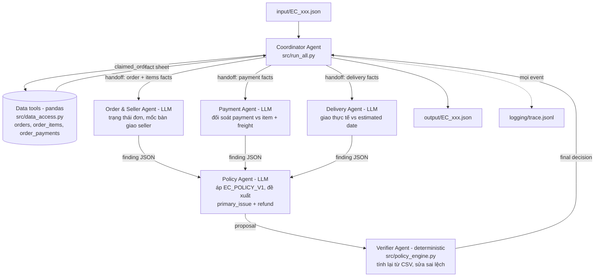

# Architecture — Multi-Agent E-commerce Dispute Resolution

## 1. Tổng quan

Hệ thống gồm 1 coordinator, 3 specialist agent chạy LLM, 1 policy agent chạy LLM và 1 verifier agent deterministic. Nguyên tắc thiết kế: **LLM phân tích và đề xuất, dữ liệu CSV quyết định**. Mọi con số và kết luận cuối cùng đều được Verifier tính lại trực tiếp từ dữ liệu Olist trước khi ghi file, nên hệ thống không thể "bịa" sự kiện không tồn tại (yêu cầu chống hallucination của đề).

Model: `llama3.2:3b` (Meta Llama 3.2 3B Instruct, 3B params ≤ giới hạn 10B), chạy local qua Ollama, khai báo trong `src/config.py`.

## 2. Sơ đồ agent và luồng handoff



## 3. Vai trò và quyền truy cập dữ liệu

| Agent | Loại | Quyền truy cập | Nhiệm vụ | Output bàn giao |
| --- | --- | --- | --- | --- |
| Coordinator | Code (`src/run_all.py`) | Đọc input/, gọi tool, điều phối | Nhận case, dựng fact sheet qua tool, giao việc, gom kết quả, ghi output | Output JSON + trace |
| Order & Seller Agent | LLM | Chỉ facts về order status, items, seller, `shipping_limit_date`, mốc carrier nhận hàng | Xác định trạng thái đơn và seller nào bàn giao quá hạn | `{order_status, sellers_past_limit, finding}` |
| Payment Agent | LLM | Chỉ facts về payment rows, item_total, freight_total | Đối soát tổng payment với item + freight (sai số 0.10 BRL), phát hiện split payment | `{n_payments, payment_total, split_payment, matches_order_value, finding}` |
| Delivery Agent | LLM | Chỉ facts về `order_delivered_customer_date`, `order_estimated_delivery_date` | Kết luận đơn giao trễ hay đúng hạn so với estimate | `{delivered, delivered_after_estimate, finding}` |
| Policy Agent | LLM | Findings của 3 specialist + số liệu tổng | Áp 6 rule EC_POLICY_V1 theo thứ tự ưu tiên, đề xuất primary_issue và refund | `{primary_issue, recommended_refund_brl, reason}` |
| Verifier Agent | Code (`src/policy_engine.py` + `src/agents.py`) | Toàn bộ fact sheet từ CSV | Tính lại độc lập toàn bộ kết luận, đối chiếu với đề xuất của Policy Agent, sửa mọi sai lệch (ghi corrections vào trace), dựng output đúng schema và giới hạn số lượng | Output JSON cuối cùng |

Mỗi specialist chỉ được nhìn đúng domain dữ liệu của mình (least privilege) — tách biệt trách nhiệm thật sự chứ không phải một prompt chung.

## 4. Luồng xử lý một case

1. Coordinator đọc `input/EC_xxx.json`, lấy `claimed_order_id`.
2. Tool `data_access.get_order_facts()` join `orders ← order_items, order_payments`, tính sẵn: tổng item/freight/payment, `delivered_after_estimate`, `carrier_after_limit` từng item, danh sách seller quá hạn.
3. Coordinator handoff lần lượt cho 3 specialist (mỗi agent một payload riêng); mỗi agent gọi `llama3.2:3b` và trả finding JSON.
4. Ba finding được handoff cho Policy Agent để chọn rule theo thứ tự ưu tiên và đề xuất refund.
5. Verifier chạy policy engine deterministic trên fact sheet, so khớp proposal của LLM; nếu lệch (issue/refund) thì sửa và ghi `corrections` vào trace. Kết quả cuối luôn khớp CSV.
6. Coordinator ghi `output/EC_xxx.json`; mọi bước (case_received, facts_compiled, handoff, llm_call, finding, proposal, verification, output_written) đều ghi vào `logging/trace.jsonl`.

## 5. Chống hallucination

- Evidence ID chỉ được dựng bằng code từ các row thật trong CSV (`order:`, `item:`, `payment:`, `seller:`, `policy:`) — LLM không tự sinh ID.
- Mọi số tiền lấy từ CSV, làm tròn 2 chữ số; LLM không được tự tính số cuối.
- Verifier có quyền phủ quyết: nếu Policy Agent (LLM) kết luận sai rule, output vẫn theo dữ liệu; sai lệch được log minh bạch trong trace (`event: verification`, field `corrections`).
- Trace ghi lại toàn bộ input/output từng lần gọi LLM kèm latency và token count để audit.

## 6. File map

```text
src/config.py        # model name, đường dẫn, giới hạn schema
src/data_access.py   # tool pandas: load CSV, dựng fact sheet
src/llm_client.py    # gọi Ollama (format=json, temperature=0), log trace
src/agents.py        # 4 LLM agent + verifier
src/policy_engine.py # EC_POLICY_V1 deterministic + dựng output schema
src/tracer.py        # ghi logging/trace.jsonl
src/run_all.py       # coordinator + entry point (python -m src.run_all)
scripts/verify_outputs.py  # kiểm tra độc lập 50 output trước khi nộp
```
