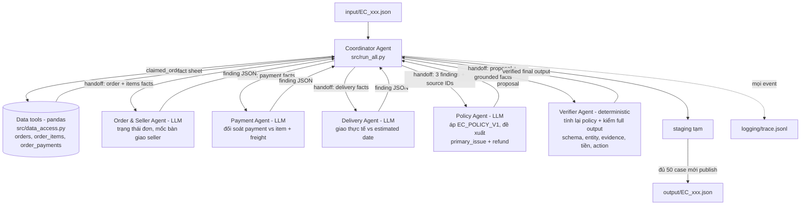

# Architecture — Multi-Agent E-commerce Dispute Resolution

## 1. Tổng quan

Hệ thống gồm 1 coordinator, 3 specialist agent chạy LLM, 1 policy agent chạy LLM và 1 verifier agent deterministic. Nguyên tắc thiết kế: **LLM phân tích và đề xuất, dữ liệu CSV quyết định**. LLM vẫn có thể đưa ra finding sai trong trace, nhưng mọi kết luận, entity, evidence ID, số tiền và action của final output đều được Verifier tính lại và kiểm tra trước khi ghi file.

Model: `llama3.2:3b` (Meta Llama 3.2 3B Instruct, 3.2B parameters ≤ giới hạn 10B), chạy local qua Ollama, khai báo trong `src/config.py`.

## 2. Sơ đồ agent và luồng handoff



## 3. Vai trò và quyền truy cập dữ liệu

| Agent | Loại | Quyền truy cập | Nhiệm vụ | Output bàn giao |
| --- | --- | --- | --- | --- |
| Coordinator | Code (`src/run_all.py`) | Đọc input/, gọi tool, điều phối | Nhận case, dựng fact sheet qua tool, giao việc, gom kết quả, ghi output | Output JSON + trace |
| Order & Seller Agent | LLM | Chỉ facts về order status, items, seller, `shipping_limit_date`, mốc carrier nhận hàng | Xác định trạng thái đơn và seller nào bàn giao quá hạn | `{order_status, sellers_past_limit, finding}` |
| Payment Agent | LLM | Chỉ facts về payment rows, item_total, freight_total | Đối soát tổng payment với item + freight (sai số 0.10 BRL), phát hiện split payment | `{n_payments, payment_total, split_payment, matches_order_value, finding}` |
| Delivery Agent | LLM | Chỉ facts về `order_delivered_customer_date`, `order_estimated_delivery_date` | Kết luận đơn giao trễ hay đúng hạn so với estimate | `{delivered, delivered_after_estimate, finding}` |
| Policy Agent | LLM | Findings của 3 specialist + số liệu tổng | Áp 6 rule EC_POLICY_V1 theo thứ tự ưu tiên, đề xuất primary_issue và refund | `{primary_issue, recommended_refund_brl, reason}` |
| Verifier Agent | Code (`src/policy_engine.py` + `src/output_validator.py` + `src/agents.py`) | Toàn bộ fact sheet từ CSV | Tính lại policy, sửa proposal sai, dựng rồi kiểm tra đầy đủ schema/entity/evidence/amount/action; fail-closed nếu có lỗi | Output JSON đã kiểm chứng |

Mỗi specialist chỉ được nhìn đúng domain dữ liệu của mình (least privilege) — tách biệt trách nhiệm thật sự chứ không phải một prompt chung.

## 4. Luồng xử lý một case

1. Coordinator đọc `input/EC_xxx.json`, lấy `claimed_order_id`.
2. Tool `data_access.get_order_facts()` join `orders ← order_items, order_payments`, tính sẵn: tổng item/freight/payment, `delivered_after_estimate`, `carrier_after_limit` từng item, danh sách seller quá hạn.
3. Coordinator tạo handoff contract có câu hỏi, nhiệm vụ, sourced facts, phần thiếu/mâu thuẫn và bước tiếp theo; sau đó giao riêng cho 3 specialist. Mỗi agent gọi `llama3.2:3b` và trả finding JSON.
4. Ba finding cùng source ID được handoff cho Policy Agent để chọn rule theo thứ tự ưu tiên và đề xuất refund/reason.
5. Verifier chạy policy engine deterministic trên fact sheet, sửa proposal LLM nếu lệch, dựng full output rồi kiểm đồng thời schema, entity, evidence, policy, số tiền, party và action. Có bất kỳ lỗi nào thì case fail và không được ghi.
6. Output đã kiểm chứng được ghi vào staging. Chỉ sau khi đủ cả 50 case, Coordinator mới publish tuần tự 50 file vào `output/` và ghi 50 event `output_written`; không có output nào bị thay trong giai đoạn gọi LLM.
7. Trace được ghi vào `logging/trace.jsonl.tmp` và atomically replace `logging/trace.jsonl` khi batch thành công; batch bị ngắt không phá trace hoàn chỉnh trước đó.

## 5. Handoff contract

Mỗi event `handoff` bắt buộc có cấu trúc sau và được `src/handoffs.py` kiểm tra trước khi gửi:

```json
{
  "ticket_id": "EC_001",
  "recipient": "payment_agent",
  "question": "Câu hỏi gốc của khách hàng",
  "assigned_task": "Nhiệm vụ domain cần trả lời",
  "sourced_facts": [
    {
      "name": "payment_total_brl",
      "value": 131.94,
      "source_ids": ["payment:<order_id>:1"]
    }
  ],
  "missing_or_conflicting_facts": [],
  "next_action": "Kết quả cần bàn giao cho agent tiếp theo"
}
```

`source_ids` chỉ được lấy từ order/item/payment/seller thật hoặc phiên bản policy. `scripts/verify_trace.py` kiểm 250 handoff (5 × 50), thứ tự handoff, source ID, full output của Verifier và file đã ghi.

## 6. Chống hallucination

- Evidence ID dữ liệu (`order:`, `item:`, `payment:`, `seller:`) chỉ được dựng bằng code từ row thật trong CSV; evidence `policy:` được dựng deterministic từ root-cause của EC_POLICY_V1. LLM không tự sinh ID cuối.
- Mọi số tiền lấy từ CSV, làm tròn 2 chữ số; LLM không được tự tính số cuối.
- Verifier có quyền phủ quyết: nếu Policy Agent (LLM) kết luận sai rule, output vẫn theo dữ liệu; sai lệch được log minh bạch trong trace (`event: verification`, field `corrections`). Verifier còn lưu `checks` và `final_output` để đối chiếu trực tiếp với JSON trên đĩa.
- Với mỗi lần gọi LLM thành công, trace ghi input/output, latency và token count; lần gọi lỗi được ghi bằng event `llm_error` để audit.

## 7. File map

```text
src/config.py        # model name, đường dẫn, giới hạn schema
src/data_access.py   # tool pandas: load CSV, dựng fact sheet
src/llm_client.py    # gọi Ollama (format=json, temperature=0), log trace
src/agents.py        # 4 LLM agent + verifier
src/handoffs.py      # schema/validation cho handoff contract
src/policy_engine.py # EC_POLICY_V1 deterministic + dựng output schema
src/output_validator.py # kiểm full output trước khi publish
src/tracer.py        # ghi logging/trace.jsonl
src/run_all.py       # coordinator + entry point (python -m src.run_all)
scripts/verify_outputs.py  # kiểm tra độc lập 50 output trước khi nộp
scripts/verify_trace.py    # kiểm trace/handoff/verifier cho đủ 50 case
scripts/package_submission.py # tạo output.zip và submission.zip từ allowlist
```
